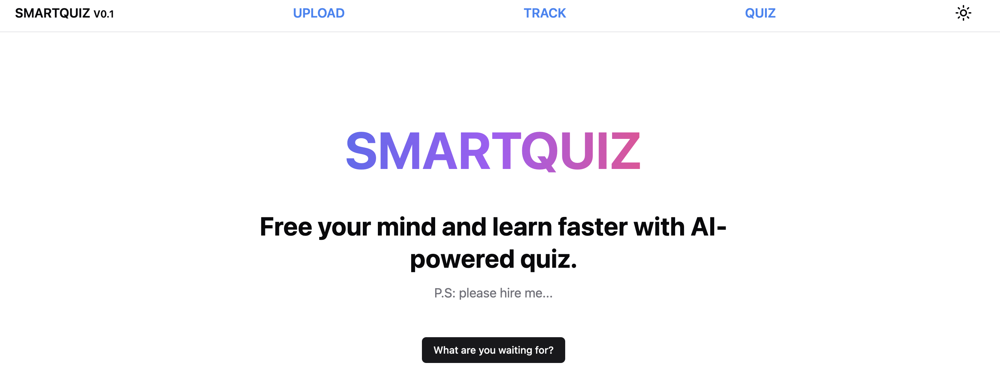
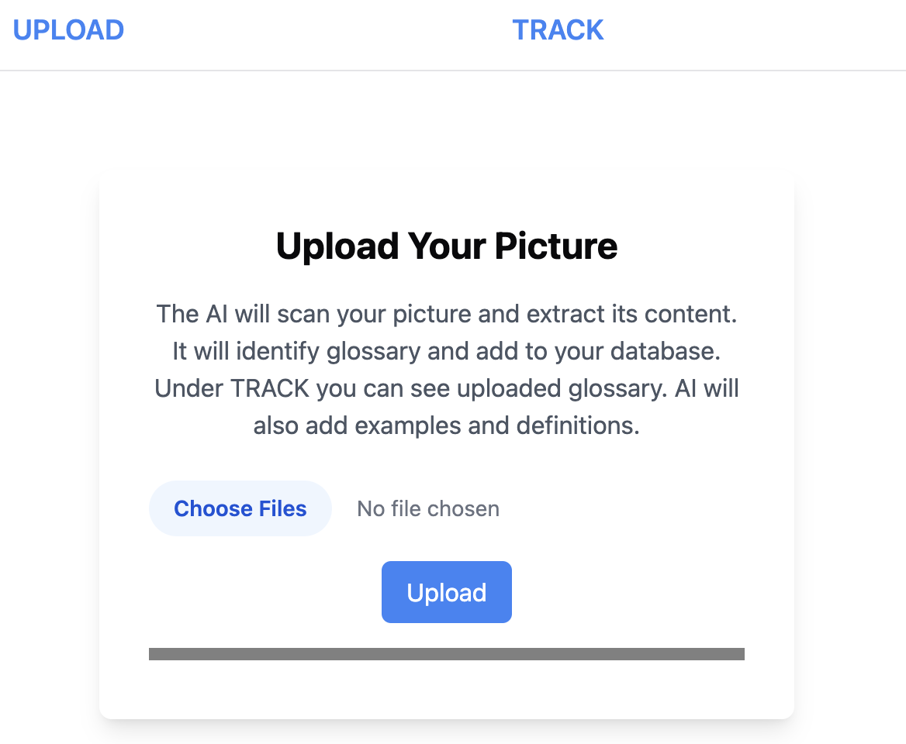
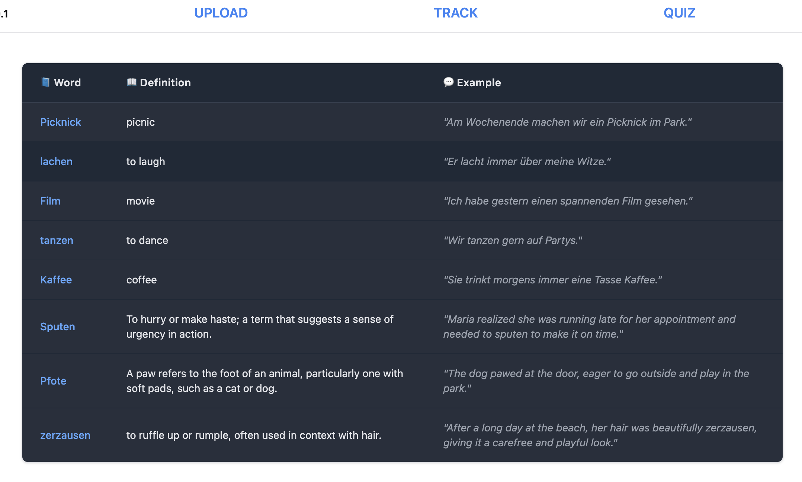

# Vocabulary Tracker: An AI-Powered Language Learning Tool

Welcome to **Vocabulary Tracker**, the smarter way to learn languages by leveraging AI! Whether you’re learning a new language or enhancing your vocabulary, this tool allows you to quickly upload images of words you encounter in daily life and get instant definitions and examples.

---

### 🚀 **Project Overview**
In the world of language learning, one of the hardest tasks is keeping track of all the new vocabulary you encounter. **Vocabulary Tracker** takes the hassle out of this process by using **AI-powered image recognition** to process pictures of words (from books, newspapers, or even phone screenshots) and automatically generates definitions, examples, and saves them for you.

**Main Features:**
1. **Easy Vocabulary Upload** – Upload images of your vocabulary. These images can come from newspapers, textbooks, or screenshots from your phone.
2. **AI-Powered Processing** – The AI extracts the vocabulary from the image, finds its definitions, and provides example sentences, all automatically!
3. **Track Your Progress** – All the vocabulary you upload gets stored in a clean and organized list so you can easily review them later and keep track of your learning.

---

### 🖼️ **Screenshots**
Here’s a sneak peek into the website:



#### Upload Page
This is where you upload your images for the AI to process. Simply drag and drop multiple images, and the tool will do the rest!



#### Vocabulary Tracker
A clean and simple interface showing a list of all your uploaded words along with their definitions and example sentences, ready for you to review and study!



---

### 🛠️ **Tech Stack**
- **Backend**: Golang
- **Frontend**: HTMX, Tailwind CSS, Template Engine
- **Database**: SQLite3
- **AI Integration**: OpenAI for image recognition and natural language processing

---

### 📚 **Why This is Awesome**
- **AI-Powered Efficiency**: No more copying definitions from dictionaries. Our AI recognizes words for you and saves you time!
- **Learn Passively**: Whether you’re reading a book, browsing a newspaper, or looking at a mobile app, capture the words you don’t know with a quick snap.
- **Track Progress**: It’s fun and motivating to see all the words you’ve learned and their meanings in one place.

---

### 🌍 **How to Use It**

```bash
git clone git@github.com:OscarPerEk/smartquiz.git
cd smartquiz
make dev
```

